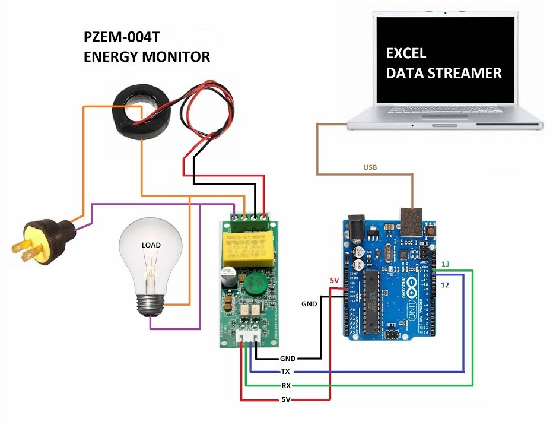
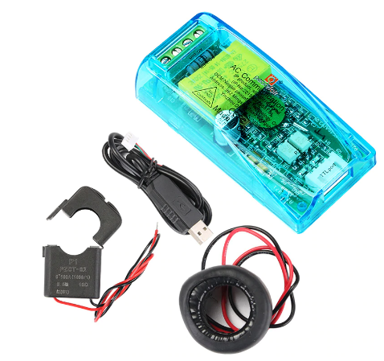
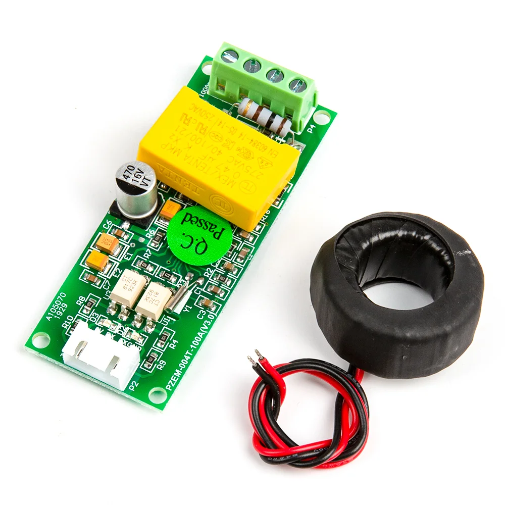

# PZEM004T_Enhanced

[](PZEM004T_Enhanced.h)
[](LICENSE)

Bibliothèque Arduino pour le compteur d'énergie **PZEM-004T v3.0**.

Elle ajoute aux mesures natives du module le calcul de la **puissance apparente (S)** et de la **puissance non-active (N)**.





---

## ⚠️ Ce qu'il faut savoir

Le PZEM-004T mesure :
- **P** (puissance active) en W
- **U** (tension) en V
- **I** (courant) en A
- **PF** = P/S (facteur de puissance **global**, qui inclut les harmoniques)

**Ce n'est pas le cosφ du déphasage fondamental.**

La bibliothèque calcule :
- **S = P / PF** (puissance apparente en VA)
- **N = √(S² - P²)** (puissance non-active en VAR)

| Type de charge | N correspond à |
|----------------|----------------|
| Sinusoïdale pure | Q (puissance réactive) |
| Avec harmoniques | √(Q² + D²) (réactive + déformante) |

**Pour obtenir Q ou D séparément**, il faudrait une mesure externe du cosφ (analyseur de réseau).

---

## Fonctionnalités

- Mesure de la **tension** (V)
- Mesure du **courant** (A)
- Mesure de la **puissance active P** (W)
- Calcul de la **puissance apparente S** (VA) — `S = P / PF`
- Calcul de la **puissance non-active N = √(S² - P²)** (VAR)
- Mesure du **facteur de puissance global PF**
- Mesure de la **fréquence** (Hz)
- Mesure de l'**énergie active** (kWh)
- Gestion des adresses Modbus
- Seuil d'alarme de puissance
- Réinitialisation du compteur d'énergie
- Compatible **HardwareSerial** et **SoftwareSerial**

---

## Compatibilité

| MCU                 | Hardware Serial | Software Serial |
|---------------------|:---------------:|:---------------:|
| ATmega328 (Uno/Nano) | ✔️ | ✔️ |
| ATmega2560 (Mega)   | ✔️ | ✔️ |
| ESP8266             | ✔️ | ✔️ |
| ESP32               | ✔️ | — |

---

## Branchement

| PZEM-004T | Arduino / ESP |
|-----------|---------------|
| VCC       | 5V            |
| GND       | GND           |
| RX        | TX (pin série)|
| TX        | RX (pin série)|
| CT (transformateur) | Fil à mesurer |



> ⚠️ Le module doit être **branché sur le secteur (230 V AC)** pour communiquer.
> 💡 Si vous obtenez des `NaN`, **inversez les fils RX/TX**.

---

## Installation

### PlatformIO

```ini
lib_deps =
    https://github.com/Fo170/PZEM004T_Enhanced.git@^1.1.0